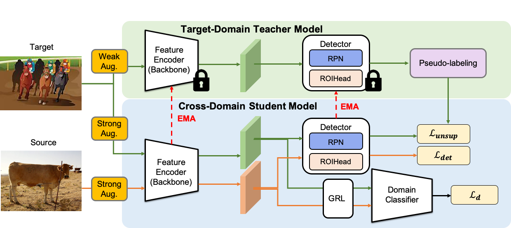

# Cross-Domain Adaptive Teacher for Object Detection

[](https://creativecommons.org/licenses/by-nc/4.0/) 

[](https://creativecommons.org/licenses/by-nc/4.0/)

This is the PyTorch implementation of our paper: <br>
**Cross-Domain Adaptive Teacher for Object Detection**<br>
 [Yu-Jhe Li](https://yujheli.github.io/), [Xiaoliang Dai](https://sites.google.com/view/xiaoliangdai), [Chih-Yao Ma](https://chihyaoma.github.io/), [Yen-Cheng Liu](https://ycliu93.github.io/), [Kan Chen](https://kanchen.info/), [Bichen Wu](https://scholar.google.com/citations?user=K3QJPdMAAAAJ&hl=en), [Zijian He](https://research.fb.com/people/he-zijian/), [Kris Kitani](http://www.cs.cmu.edu/~kkitani/), [Peter Vajda](https://sites.google.com/site/vajdap)<br>
IEEE/CVF Conference on Computer Vision and Pattern Recognition (CVPR), 2022 <br>

[[Paper](https://yujheli.github.io/projects/CVPR2022_assest/paper_adaptive_teacher_cvpr22.pdf)] [[Project](https://yujheli.github.io/projects/adaptiveteacher.html)]

<p align="center">

</p>

# Installation

## Prerequisites

- Python ≥ 3.6
- PyTorch ≥ 1.5 and torchvision that matches the PyTorch installation.

## Install python env

To install required dependencies on the virtual environment of the python (e.g., virtualenv for python3), please run the following command at the root of this code:
```
$ python3 -m venv /path/to/new/virtual/environment/.
$ source /path/to/new/virtual/environment/bin/activate
```
For example:
```
$ mkdir python_env
$ python3 -m venv python_env/
$ source python_env/bin/activate
```
 

## Build Detectron2 from Source

Follow the [INSTALL.md](https://github.com/facebookresearch/detectron2/blob/master/INSTALL.md) to install Detectron2.

## Dataset download

1. Download the datasets


2. Organize the dataset as the Cityscapes and PASCAL VOC format following:

```shell
adaptive_teacher/
└── datasets/
    └── cityscapes/
        ├── gtFine/
            ├── train/
            └── test/
            └── val/
        ├── leftImg8bit/
            ├── train/
            └── test/
            └── val/
   └── cityscapes_foggy/
        ├── gtFine/
            ├── train/
            └── test/
            └── val/
        ├── leftImg8bit/
            ├── train/
            └── test/
            └── val/
   └── VOC2012/
        ├── Annotations/
        ├── ImageSets/
        └── JPEGImages/
   └── clipark/
        ├── Annotations/
        ├── ImageSets/
        └── JPEGImages/
```

# Training

- Train the Adaptive Teacher under PASCAL VOC (source) and Clipart1k (target)

```shell
python train_net.py \
      --num-gpus 8 \
      --config configs/faster_rcnn_R101_cross_clipart.yaml\
```

- Train the  Adaptive Teacher under cityscapes (source) and foggy cityscapes (target)

```shell
python train_net.py\
      --num-gpus 8\
      --config configs/faster_rcnn_VGG_cross_city.yaml\
      OUTPUT_DIR output/exp_city
```

## Resume the training

```shell
python train_net.py \
      --resume \
      --num-gpus 8 \
      --config configs/faster_rcnn_R101_cross_clipart.yaml MODEL.WEIGHTS <your weight>.pth
```

## Evaluation

```shell
python train_net.py \
      --eval-only \
      --num-gpus 8 \
      --config configs/faster_rcnn_R101_cross_clipart.yaml \
      MODEL.WEIGHTS <your weight>.pth
```

## Results and Model Weights

### Real to Artistic Adaptation:
|  Backbone  | Source set (labeled) |  Target set (unlabeled)  |       Batch size        | AP@.5   |    Model Weights      | Comment |
| :-----: | :---------------: | :----------------: | :---------------------: | :-----: | :----------: |:-----: | 
| R101 |    VOC12    |      Clipark1k      | 16 labeled + 16 unlabeled | 40.6  | link (coming soon)| Ours w/o discriminator|
| R101 |    VOC12    |      Clipark1k      | 16 labeled + 16 unlabeled | 49.3  | link (coming soon)| Ours in the paper|
| R101+FPN |    VOC12    | Clipark1k | 16 labeled + 16 unlabeled | 51.2  |link (coming soon) | For future work|

### Weather Adaptation:
|  Backbone  | Source set (labeled) |  Target set (unlabeled)  |       Batch size        | AP@.5   |    Model Weights      | Comment|
| :-----: | :---------------: | :----------------: | :---------------------: | :-----: | :--------------------------------------------------: |:-----: | 
| VGG16|    Cityscapes    |      Foggy Cityscapes      | 16 labeled + 16 unlabeled | 48.7  | link (coming soon)|Ours w/o discriminator|
| VGG16|    Cityscapes    |      Foggy Cityscapes      | 16 labeled + 16 unlabeled | 50.9  | link (coming soon)|Ours in the paper|
| VGG16+FPN |    Cityscapes    |  Foggy Cityscapes | 16 labeled + 16 unlabeled | 57.4  |link (coming soon) |For future work|

## Citation

If you use Adaptive Teacher in your research or wish to refer to the results published in the paper, please use the following BibTeX entry.

```BibTeX
@inproceedings{li2022cross,
    title={Cross-Domain Adaptive Teacher for Object Detection},
    author={Li, Yu-Jhe and Dai, Xiaoliang and Ma, Chih-Yao and Liu, Yen-Cheng and Chen, Kan and Wu, Bichen and He, Zijian and Kitani, Kris and Vajda, Peter},
    booktitle={IEEE Conference on Computer Vision and Pattern Recognition (CVPR)},
    year={2022}
} 
```

Also, if you use Detectron2 in your research, please use the following BibTeX entry.

```BibTeX
@misc{wu2019detectron2,
  author =       {Yuxin Wu and Alexander Kirillov and Francisco Massa and
                  Wan-Yen Lo and Ross Girshick},
  title =        {Detectron2},
  howpublished = {\url{https://github.com/facebookresearch/detectron2}},
  year =         {2019}
}
```

## License

This project is licensed under CC-BY-NC 4.0 License, as found in the LICENSE file.
